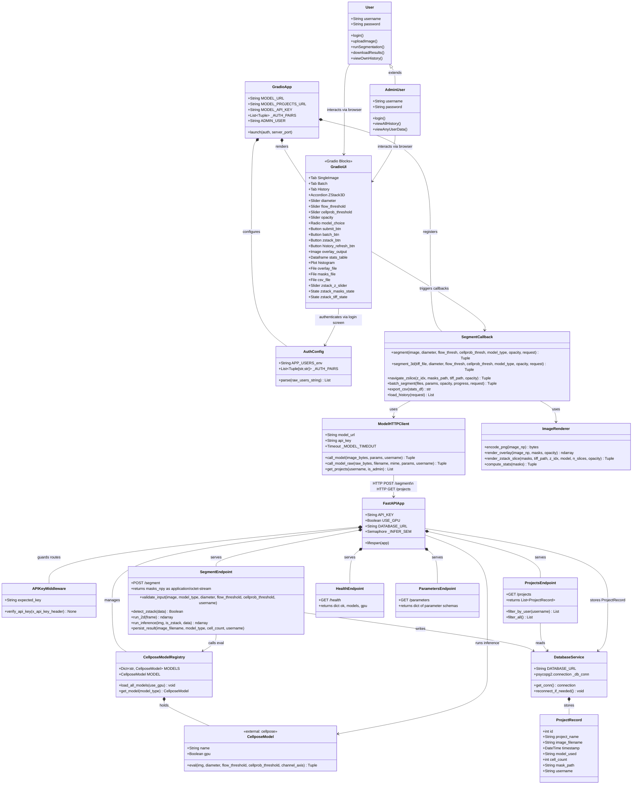
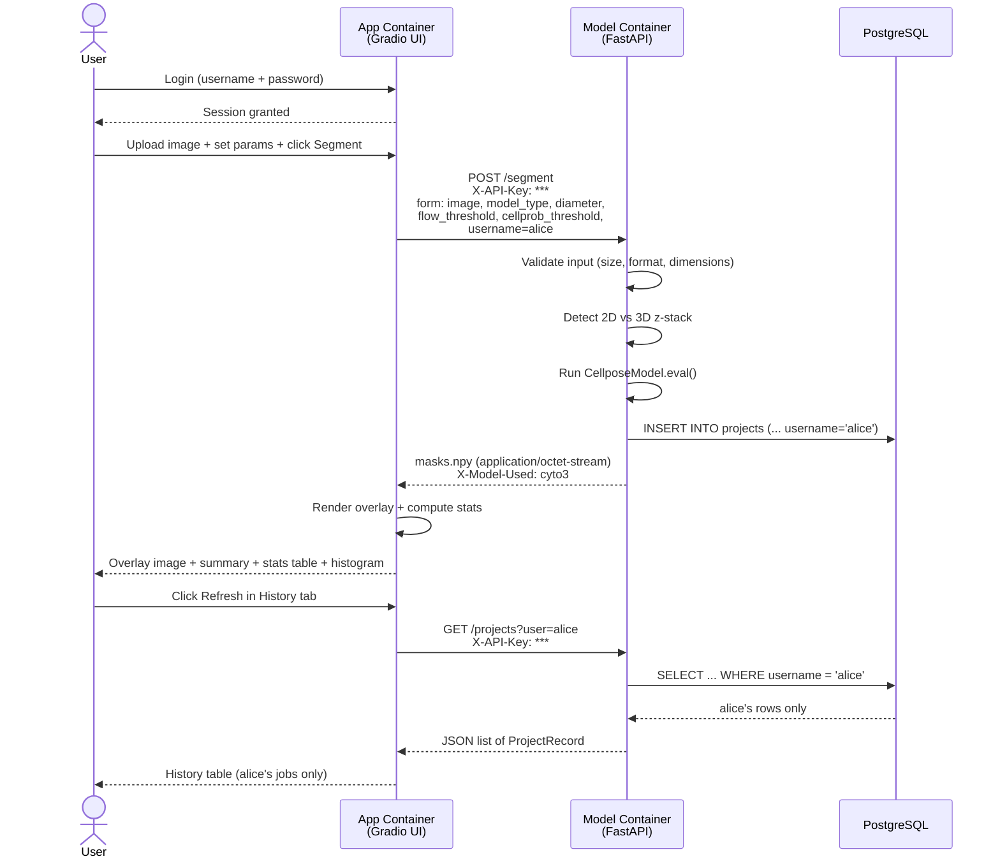
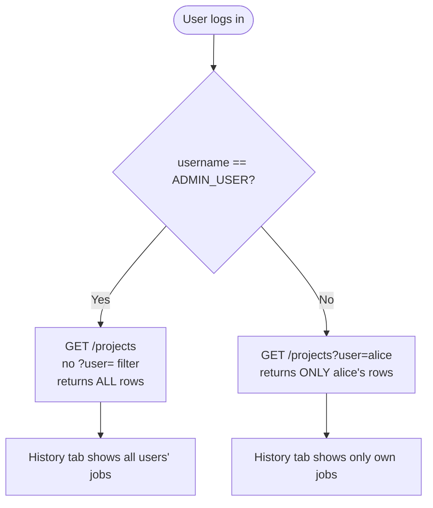

# Class Diagram — Cell Segmentation Platform

This document describes the full component model of the POC, including user roles, containers, services, data models, and their relationships.

---

## Full Class Diagram (Mermaid)

---

## Component Descriptions

### User Roles

| Role | Access |
|------|--------|
| **User** | Can log in, upload images, run segmentation, download results, view **only their own** history |
| **AdminUser** | Same as User plus can view history for **all** users (username matches `ADMIN_USER` env var) |

### App Container (`App_container/app.py`)

| Component | Responsibility |
|-----------|---------------|
| `GradioApp` | Entry point — configures auth, launches Gradio on port 8001 |
| `AuthConfig` | Parses `APP_USERS` env var into `(username, password)` pairs for Gradio login |
| `ModelHTTPClient` | Sends HTTP requests to Model Container with `X-API-Key` header; forwards `username` as form field |
| `ImageRenderer` | Converts masks to coloured overlays, normalises 16-bit TIFFs, computes per-cell stats |
| `SegmentCallback` | All Python callbacks wired to Gradio buttons; extracts `request.username` for per-user isolation |
| `GradioUI` | Declares the three-tab Blocks layout: Single Image, Batch, History (+ 3D accordion) |

### Model Container (`Model_container/cellpose_api/app.py`)

| Component | Responsibility |
|-----------|---------------|
| `FastAPIApp` | Entry point — FastAPI application with lifespan model loading |
| `APIKeyMiddleware` | `verify_api_key` dependency — returns HTTP 401 when `API_KEY` env is set and header is wrong/missing |
| `CellposeModelRegistry` | Loads `cyto3` and `cpsam` models in parallel at startup; holds them in `MODELS` dict |
| `CellposeModel` | External Cellpose library — performs actual cell segmentation via `eval()` |
| `SegmentEndpoint` | `POST /segment` — validates input, detects z-stack, runs inference, writes to DB, returns `masks.npy` |
| `ProjectsEndpoint` | `GET /projects?user=<name>` — returns user's rows (or all rows when `user` is omitted for admin) |
| `HealthEndpoint` | `GET /health` — returns model load status; returns 503 while loading |
| `ParametersEndpoint` | `GET /parameters` — returns parameter schema (used to populate UI defaults) |

### Database (`postgres:16-alpine`, internal)

| Component | Responsibility |
|-----------|---------------|
| `DatabaseService` | Manages `psycopg2` singleton connection with auto-reconnect; skipped gracefully when `DATABASE_URL` unset |
| `ProjectRecord` | One row per segmentation job — stores `username` for per-user isolation |

---

## Request Flow — Single Image Segmentation

---

## Admin vs User Data Isolation

---

## Environment Variables Summary

| Variable | Container | Purpose |
|----------|-----------|---------|
| `APP_USERS` | App | Comma-separated `user:pass` pairs — enables Gradio login screen |
| `ADMIN_USER` | App | Username that bypasses per-user filter and sees all history |
| `MODEL_API_KEY` | App | Sent as `X-API-Key` header on every call to Model Container |
| `MODEL_URL` | App | URL of Model Container segment endpoint |
| `API_KEY` | Model | Expected `X-API-Key` value; blank = open dev mode |
| `USE_GPU` | Model | `true` / `false` — passed to `CellposeModel(gpu=...)` |
| `DATABASE_URL` | Model | PostgreSQL connection string; blank = no persistence |
