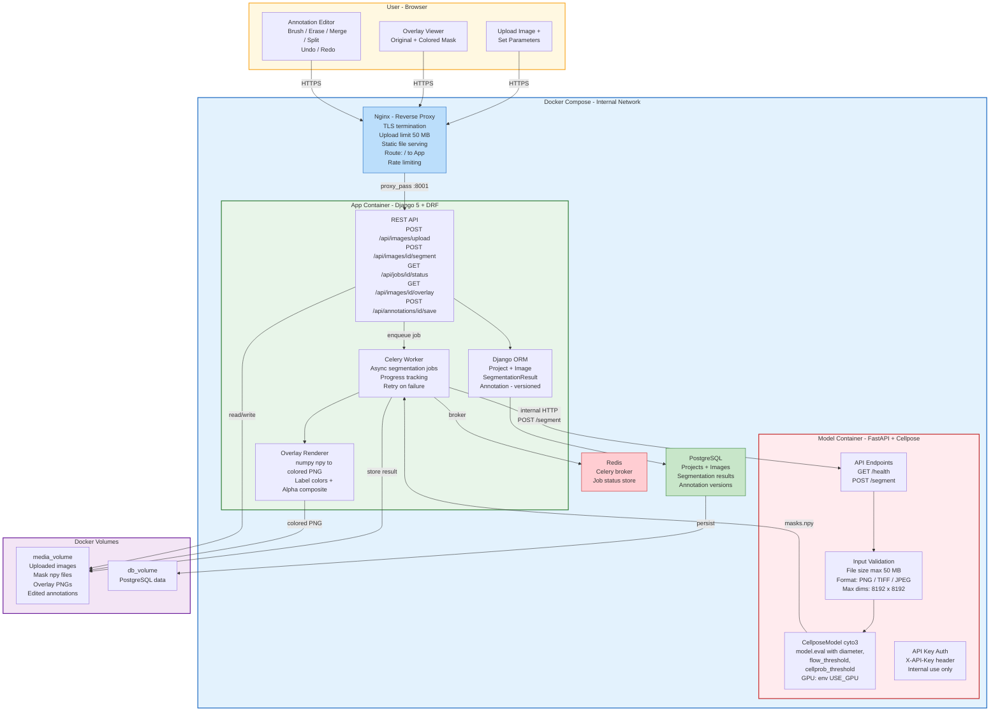
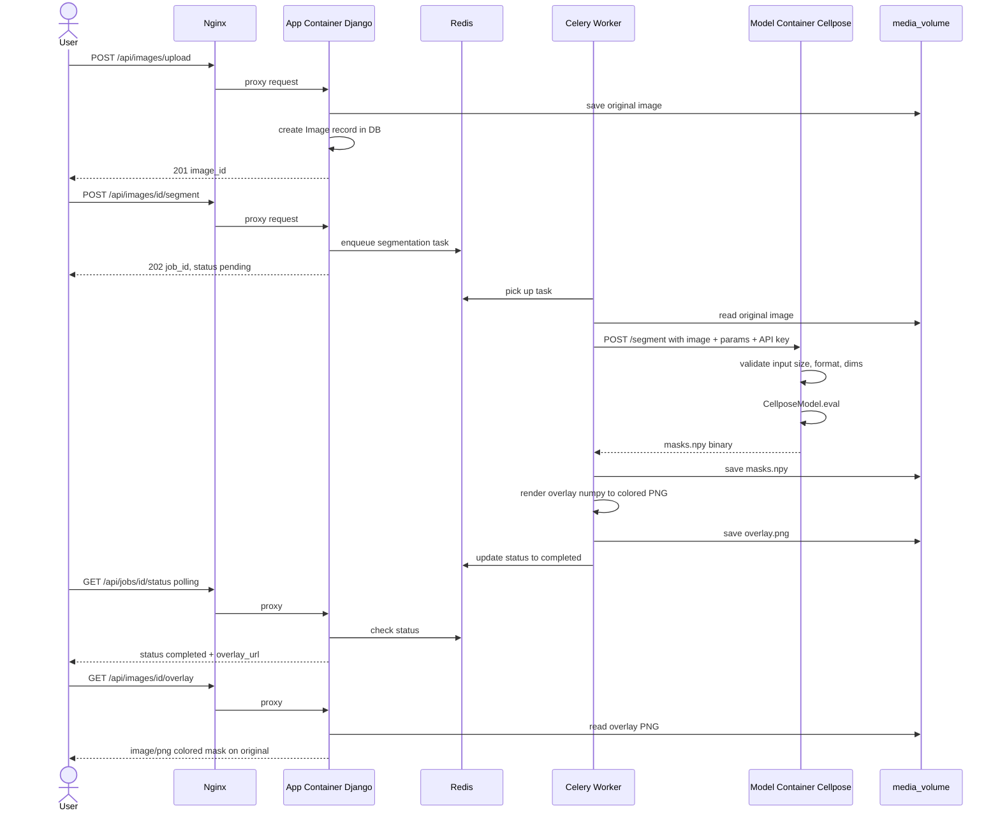
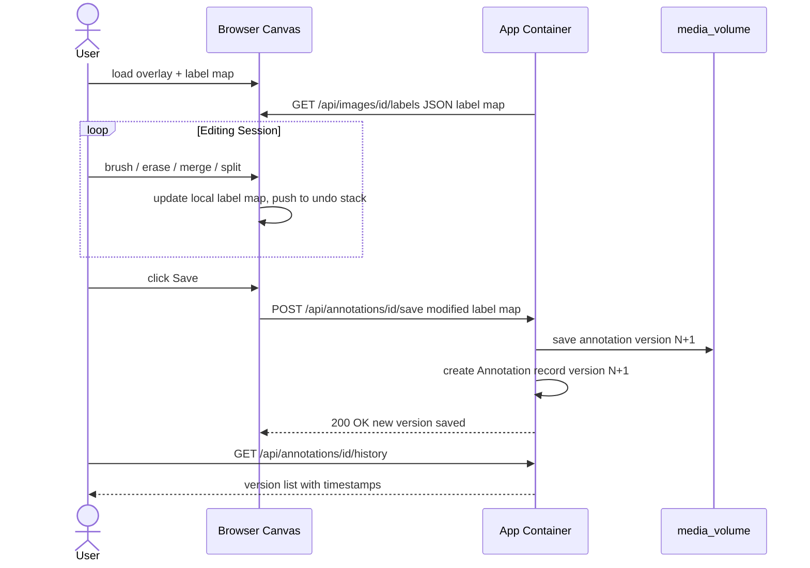

# Improved System Architecture — Cell Segmentation Platform

## Overview

A browser-based cell segmentation and annotation platform built on two Docker containers orchestrated behind a reverse proxy. Users upload microscopy images, run Cellpose segmentation, view colored mask overlays, and refine annotations with editing tools — all persisted to disk.

---

## Architecture Diagram



---

## Data Flow — Segmentation Request



---

## Data Flow — Annotation Editing



---

## Component Details

### Nginx — Reverse Proxy

| Concern | Configuration |
|---------|--------------|
| Entry point | Port 443 (HTTPS) or 80 (HTTP dev) |
| Upload limit | `client_max_body_size 50m` |
| Routing | `/` → App Container `:8001` |
| Static files | `/static/` served directly from volume |
| Media files | `/media/` served directly from volume |
| Rate limiting | 10 req/s per IP on `/api/` |
| Model Container | **Not exposed** — internal network only |

### App Container — Django 5

**Responsibilities:**
- User-facing web UI (templates + HTMX)
- REST API for image/annotation CRUD
- Async job orchestration via Celery
- Server-side mask → overlay rendering
- Annotation version management

**Data Models:**

```
Project
├── id: UUID
├── name: str
├── created_at: datetime
│
├── Image (FK → Project)
│   ├── id: UUID
│   ├── file: FileField (→ media_volume)
│   ├── width, height: int
│   ├── uploaded_at: datetime
│   │
│   ├── SegmentationResult (FK → Image)
│   │   ├── id: UUID
│   │   ├── mask_file: FileField (.npy)
│   │   ├── overlay_file: FileField (.png)
│   │   ├── cell_count: int
│   │   ├── parameters: JSON {diameter, flow_threshold, cellprob_threshold}
│   │   ├── created_at: datetime
│   │   │
│   │   └── Annotation (FK → SegmentationResult)
│   │       ├── id: UUID
│   │       ├── mask_file: FileField (edited .npy)
│   │       ├── version: int (auto-increment)
│   │       ├── created_at: datetime
│   │       └── parent_version: FK → self (nullable)
```

**API Endpoints:**

| Method | Path | Purpose | Response |
|--------|------|---------|----------|
| `POST` | `/api/images/upload` | Upload image to project | `201 { image_id }` |
| `POST` | `/api/images/:id/segment` | Trigger async segmentation | `202 { job_id }` |
| `GET` | `/api/jobs/:id/status` | Poll job progress | `200 { status, progress, overlay_url }` |
| `GET` | `/api/images/:id/overlay` | Get rendered overlay PNG | `200 image/png` |
| `GET` | `/api/images/:id/labels` | Get label map as JSON | `200 { labels: [...] }` |
| `POST` | `/api/annotations/:id/save` | Save edited mask (new version) | `200 { version }` |
| `GET` | `/api/annotations/:id/history` | List annotation versions | `200 [{ version, created_at }]` |

### Model Container — FastAPI + Cellpose (hardened)

**Improvements over current version:**

| Current | Improved |
|---------|----------|
| No input validation | File size ≤ 50 MB, format whitelist, max 8192×8192 |
| `gpu=False` hardcoded | `USE_GPU` environment variable |
| No auth | `X-API-Key` header validation |
| Unstructured errors | `{ error: str, code: str, detail: str }` |
| .npy only response | Optional `?format=png` for overlay |
| Exposed on port 8002 | Internal network only, not port-mapped |

**API Contract:**

```
POST /segment
Headers:  X-API-Key: <key>
Body:     multipart/form-data
  - image: file (PNG/TIFF/JPEG, ≤ 50 MB)
  - diameter: float (optional)
  - flow_threshold: float (default 0.4)
  - cellprob_threshold: float (default 0.0)
  - format: str ("npy" | "png", default "npy")

Response 200:
  format=npy → application/octet-stream (numpy array)
  format=png → image/png (colored mask)

Response 422: { error, code: "VALIDATION_ERROR", detail }
Response 500: { error, code: "SEGMENTATION_ERROR", detail }
```

### Redis

- Celery message broker
- Job status cache (TTL: 1 hour)
- No persistence needed (ephemeral task state)

### PostgreSQL

- Project, Image, SegmentationResult, Annotation records
- Persisted to `db_volume`
- SQLite acceptable for single-user dev/POC

---

## Frontend — Annotation Editor

### Tools

| Tool | Behavior | Implementation |
|------|----------|----------------|
| **Brush** | Paint label ID onto pixels | Canvas `fillRect` with current label color |
| **Eraser** | Set pixels to label 0 (background) | Canvas `fillRect` with background |
| **Merge** | Click cell A, then cell B → all B pixels become A | Flood-fill relabel in label map array |
| **Split** | Draw line through cell → watershed split | Send line coords to backend, watershed on server |
| **Undo** | Revert last action | Command pattern stack (label map snapshots) |
| **Redo** | Re-apply undone action | Forward stack from undo |
| **Zoom/Pan** | Navigate large images | CSS transform + wheel events |
| **Opacity** | Adjust mask transparency | Canvas `globalAlpha` slider |

### Client-Side State

```
EditorState {
  originalImage: ImageBitmap       // immutable
  labelMap: Int32Array             // W×H array of label IDs
  colorTable: Map<int, RGBA>       // label → color
  undoStack: LabelMap[]            // previous states
  redoStack: LabelMap[]            // undone states
  activeTool: "brush"|"erase"|"merge"|"split"
  brushSize: int
  selectedLabel: int
  opacity: float
}
```

---

## Docker Compose — Production

```yaml
services:
  nginx:
    image: nginx:alpine
    ports:
      - "80:80"
    volumes:
      - ./nginx.conf:/etc/nginx/conf.d/default.conf:ro
      - static_volume:/static
      - media_volume:/media
    depends_on:
      app:
        condition: service_healthy

  app:
    build: ./App_container
    expose:
      - "8001"
    environment:
      - DATABASE_URL=postgres://user:pass@db:5432/cellseg
      - CELERY_BROKER_URL=redis://redis:6379/0
      - MODEL_API_URL=http://model:8000
      - MODEL_API_KEY=${MODEL_API_KEY}
    volumes:
      - media_volume:/app/media
      - static_volume:/app/static
    depends_on:
      db:
        condition: service_healthy
      redis:
        condition: service_started
      model:
        condition: service_healthy
    healthcheck:
      test: ["CMD", "curl", "-f", "http://localhost:8001/health"]
      interval: 15s
      retries: 3

  celery:
    build: ./App_container
    command: celery -A config worker -l info --concurrency=2
    environment:
      - DATABASE_URL=postgres://user:pass@db:5432/cellseg
      - CELERY_BROKER_URL=redis://redis:6379/0
      - MODEL_API_URL=http://model:8000
      - MODEL_API_KEY=${MODEL_API_KEY}
    volumes:
      - media_volume:/app/media
    depends_on:
      - redis
      - model

  model:
    build: ./Model_container
    expose:
      - "8000"
    environment:
      - PYTHONUNBUFFERED=1
      - USE_GPU=false
      - API_KEY=${MODEL_API_KEY}
    healthcheck:
      test: ["CMD", "curl", "-f", "http://localhost:8000/health"]
      interval: 15s
      retries: 5
      start_period: 120s
    deploy:
      resources:
        limits:
          memory: 4G

  redis:
    image: redis:7-alpine
    expose:
      - "6379"

  db:
    image: postgres:16-alpine
    environment:
      - POSTGRES_DB=cellseg
      - POSTGRES_USER=user
      - POSTGRES_PASSWORD=${DB_PASSWORD}
    volumes:
      - db_volume:/var/lib/postgresql/data
    healthcheck:
      test: ["CMD-SHELL", "pg_isready -U user -d cellseg"]
      interval: 10s
      retries: 5

volumes:
  media_volume:
  static_volume:
  db_volume:
```

---

## Key Design Decisions

| Decision | Choice | Rationale |
|----------|--------|-----------|
| App framework | Django 5 + DRF | ORM, admin panel, file handling — good for a POC that may grow |
| Task queue | Celery + Redis | Proven async pattern for long-running jobs; progress tracking built in |
| Frontend | Django templates + HTMX + Canvas | No JS build toolchain; HTMX handles polling; Canvas handles pixel editing |
| Overlay rendering | Server-side (numpy + Pillow) | Avoids shipping .npy to browser; simpler frontend |
| Annotation storage | Versioned .npy files | Each save creates a new version; full undo history on disk |
| Model Container isolation | Internal network, no port mapping | Only the App Container can reach it; attack surface minimized |

---

## Security Considerations

- Model Container is **never exposed** to the public network
- API key required for internal Model API calls
- Nginx enforces upload size limits (50 MB)
- Input validation at both App and Model layers (defense in depth)
- File type validation by magic bytes, not just extension
- No user-supplied filenames used in paths (UUID-based storage)
- Environment variables for all secrets (`.env` file, not committed)

---

## What Changed vs. Original Concept

| Original | Improved |
|----------|----------|
| 2 containers, both exposed | 6 services, only Nginx exposed |
| Storage "optional" | Storage mandatory (PostgreSQL + volumes) |
| Sync HTTP only | Async jobs (Celery) + polling |
| No input validation | Validation at Nginx, App, and Model layers |
| .npy over HTTP to browser | Server-side overlay rendering → PNG |
| No auth | API key auth on internal calls |
| No error contract | Structured error responses |
| No edit versioning | Versioned annotation history |
| Hardcoded GPU=false | Configurable via environment |
| Broken docker-compose | Full multi-service compose with healthchecks |
