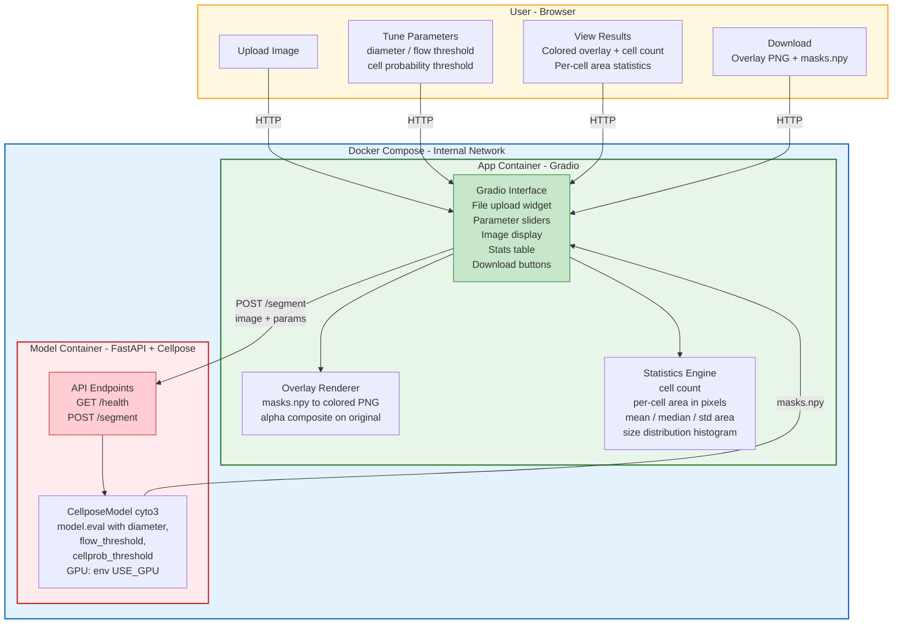
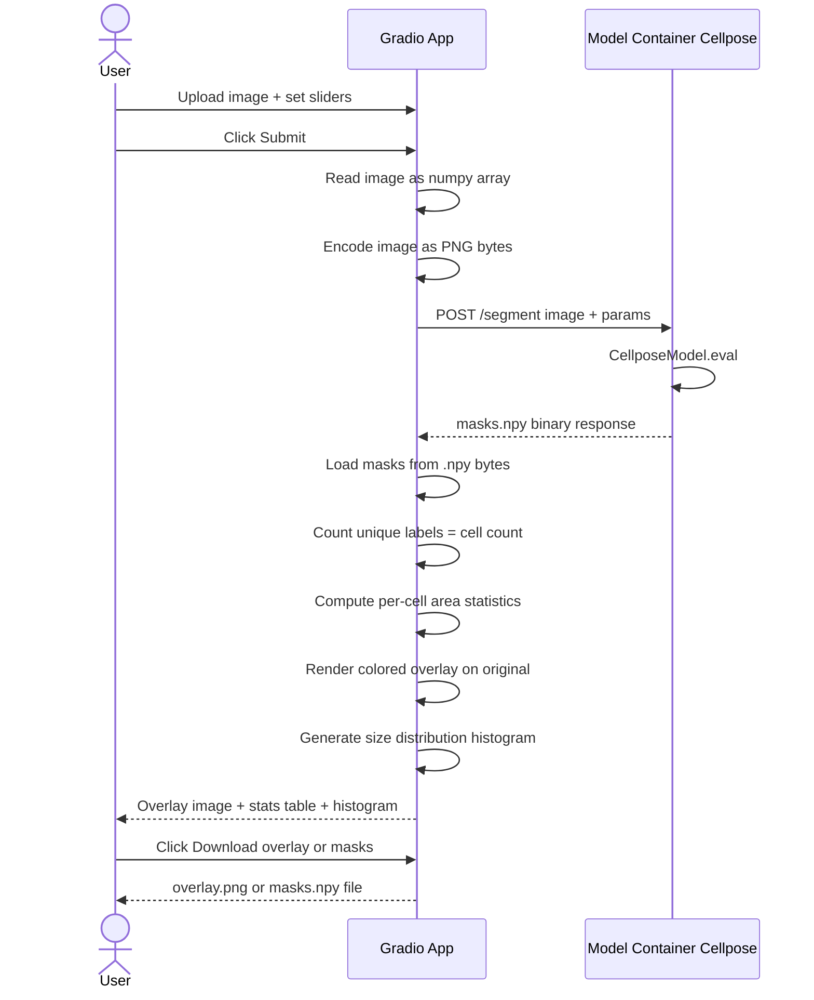

# System Architecture — Cell Segmentation Platform (POC v1)

## Overview

A minimal browser-based cell segmentation tool built on **two Docker containers**. Users upload microscopy images, tune Cellpose parameters, and get back a colored segmentation overlay with cell count and per-cell statistics. No annotation editing, no database, no task queue — just upload, segment, view results.

**Stack:** Gradio (App Container) + FastAPI/Cellpose (Model Container)

---

## Architecture Diagram



---

## Data Flow — Segmentation Request



---

## Component Details

### App Container — Gradio

**Single Python file (~100 lines).** No framework, no ORM, no templates.

**Responsibilities:**
- File upload UI with drag-and-drop
- Parameter sliders (diameter, flow threshold, cell probability threshold)
- Internal HTTP call to Model Container
- Mask deserialization (.npy bytes to numpy array)
- Overlay rendering (colored labels alpha-composited on original image)
- Statistics computation (cell count, area per cell, distribution)
- Result display (overlay image, stats table, histogram)
- Download buttons (overlay PNG, raw masks .npy)

**UI Elements (all provided by Gradio built-in components):**

| Component | Gradio Widget | Purpose |
|-----------|--------------|---------|
| Image upload | `gr.Image(type="numpy")` | Accepts PNG, TIFF, JPEG via drag-and-drop |
| Diameter | `gr.Slider(0, 200, value=30)` | Cellpose diameter parameter |
| Flow threshold | `gr.Slider(0, 1, value=0.4)` | Cellpose flow threshold |
| Cell prob threshold | `gr.Slider(-6, 6, value=0.0)` | Cellpose cell probability threshold |
| Overlay output | `gr.Image(label="Segmentation")` | Colored mask overlay on original |
| Cell count | `gr.Textbox()` | Summary: "142 cells detected" |
| Stats table | `gr.Dataframe()` | Per-cell ID, area (px), area (pct) |
| Histogram | `gr.Plot()` | Cell size distribution (matplotlib) |
| Download overlay | `gr.File()` | Download overlay as PNG |
| Download masks | `gr.File()` | Download raw masks as .npy |

**Dependencies (requirements.txt):**

```
gradio
httpx
numpy
Pillow
matplotlib
```

**Dockerfile:**

```dockerfile
FROM python:3.11-slim

WORKDIR /app
COPY requirements.txt .
RUN pip install --no-cache-dir -r requirements.txt

COPY app.py .

EXPOSE 8001
CMD ["python", "app.py"]
```

### Model Container — FastAPI + Cellpose (existing, hardened)

**Improvements over current version:**

| Current | Improved |
|---------|----------|
| No input validation | File size max 50 MB, format whitelist, max 8192x8192 |
| `gpu=False` hardcoded | `USE_GPU` environment variable |
| Unstructured errors | Structured error dict with code field |
| Exposed on port 8002 | Internal network only, not port-mapped |

**API Contract:**

```
GET /health
Response 200: { ok: true, model: "cyto3", gpu: false }

POST /segment
Body: multipart/form-data
  - image: file (PNG/TIFF/JPEG, max 50 MB)
  - diameter: float (optional)
  - flow_threshold: float (default 0.4)
  - cellprob_threshold: float (default 0.0)

Response 200: application/octet-stream (masks as numpy .npy)
Response 422: { detail: "validation error message" }
Response 500: { detail: "segmentation error message" }
```

---

## App Container — Full Source Code

```python
import io
import tempfile
import numpy as np
import httpx
import gradio as gr
import matplotlib
matplotlib.use("Agg")
import matplotlib.pyplot as plt
from PIL import Image

MODEL_URL = "http://model:8000/segment"


def segment(image, diameter, flow_threshold, cellprob_threshold):
    """Upload image to Model Container, return overlay + stats."""
    if image is None:
        raise gr.Error("Please upload an image first.")

    # Encode image as PNG bytes
    buf = io.BytesIO()
    Image.fromarray(image).save(buf, format="PNG")
    buf.seek(0)

    # Call Model Container
    try:
        resp = httpx.post(
            MODEL_URL,
            files={"image": ("image.png", buf.getvalue(), "image/png")},
            data={
                "diameter": diameter if diameter > 0 else "",
                "flow_threshold": flow_threshold,
                "cellprob_threshold": cellprob_threshold,
            },
            timeout=120.0,
        )
        resp.raise_for_status()
    except httpx.HTTPStatusError as e:
        raise gr.Error(f"Segmentation failed: {e.response.text}")
    except httpx.ConnectError:
        raise gr.Error("Model container unavailable. Is it running?")

    # Parse masks
    masks = np.load(io.BytesIO(resp.content))
    labels = np.unique(masks)
    labels = labels[labels != 0]  # exclude background
    cell_count = len(labels)

    # --- Colored overlay ---
    overlay = image.copy().astype(np.float32) / 255.0
    cmap = plt.cm.get_cmap("tab20", max(cell_count, 1))
    for i, label_id in enumerate(labels):
        color = np.array(cmap(i % 20)[:3])
        mask = masks == label_id
        overlay[mask] = overlay[mask] * 0.45 + color * 0.55
    overlay_uint8 = (overlay * 255).astype(np.uint8)

    # --- Per-cell stats ---
    total_pixels = masks.shape[0] * masks.shape[1]
    stats_rows = []
    areas = []
    for label_id in labels:
        area_px = int(np.sum(masks == label_id))
        areas.append(area_px)
        stats_rows.append({
            "Cell ID": int(label_id),
            "Area (px)": area_px,
            "Area (%)": round(area_px / total_pixels * 100, 3),
        })

    # --- Summary ---
    areas_arr = np.array(areas) if areas else np.array([0])
    summary = (
        f"{cell_count} cells detected\n"
        f"Mean area: {areas_arr.mean():.0f} px | "
        f"Median: {np.median(areas_arr):.0f} px | "
        f"Std: {areas_arr.std():.0f} px\n"
        f"Smallest: {areas_arr.min()} px | "
        f"Largest: {areas_arr.max()} px"
    )

    # --- Histogram ---
    fig, ax = plt.subplots(figsize=(6, 3))
    if cell_count > 0:
        ax.hist(areas, bins=min(30, cell_count), color="#2E7D32", edgecolor="white")
    ax.set_xlabel("Cell area (pixels)")
    ax.set_ylabel("Count")
    ax.set_title("Cell size distribution")
    fig.tight_layout()

    # --- Downloadable files ---
    overlay_path = tempfile.NamedTemporaryFile(suffix=".png", delete=False).name
    Image.fromarray(overlay_uint8).save(overlay_path)
    masks_path = tempfile.NamedTemporaryFile(suffix=".npy", delete=False).name
    np.save(masks_path, masks)

    return overlay_uint8, summary, stats_rows, fig, overlay_path, masks_path


# --- Gradio UI ---
with gr.Blocks(title="Cell Segmentation - Cellpose") as demo:
    gr.Markdown("# Cell Segmentation (Cellpose cyto3)")
    gr.Markdown("Upload a microscopy image, adjust parameters, and get segmentation results.")

    with gr.Row():
        with gr.Column(scale=1):
            img_input = gr.Image(type="numpy", label="Upload image")
            diameter = gr.Slider(0, 200, value=30, step=1, label="Diameter (0 = auto)")
            flow_thresh = gr.Slider(0, 1, value=0.4, step=0.05, label="Flow threshold")
            cellprob_thresh = gr.Slider(-6, 6, value=0.0, step=0.5, label="Cell probability threshold")
            submit_btn = gr.Button("Segment", variant="primary")

        with gr.Column(scale=2):
            overlay_output = gr.Image(label="Segmentation overlay")
            summary_box = gr.Textbox(label="Summary", lines=3)

    with gr.Row():
        stats_table = gr.Dataframe(label="Per-cell statistics", headers=["Cell ID", "Area (px)", "Area (%)"])
        histogram = gr.Plot(label="Size distribution")

    with gr.Row():
        overlay_file = gr.File(label="Download overlay PNG")
        masks_file = gr.File(label="Download masks.npy")

    submit_btn.click(
        fn=segment,
        inputs=[img_input, diameter, flow_thresh, cellprob_thresh],
        outputs=[overlay_output, summary_box, stats_table, histogram, overlay_file, masks_file],
    )

demo.launch(server_name="0.0.0.0", server_port=8001)
```

---

## Docker Compose

```yaml
services:
  app:
    build: ./App_container
    ports:
      - "8001:8001"
    environment:
      - GRADIO_SERVER_NAME=0.0.0.0
    depends_on:
      model:
        condition: service_healthy

  model:
    build: ./Model_container
    expose:
      - "8000"
    environment:
      - PYTHONUNBUFFERED=1
      - USE_GPU=false
    healthcheck:
      test: ["CMD", "curl", "-f", "http://localhost:8000/health"]
      interval: 15s
      retries: 5
      start_period: 120s
    deploy:
      resources:
        limits:
          memory: 4G
```

**That's the entire infrastructure.** Two containers. No Nginx, no Redis, no PostgreSQL, no Celery.

---

## Key Design Decisions

| Decision | Choice | Rationale |
|----------|--------|-----------|
| App framework | Gradio | Single .py file, built-in upload/slider/image/table widgets, zero JS |
| Overlay rendering | In-process (numpy + matplotlib) | No separate service needed, runs inside Gradio callback |
| Architecture | Synchronous call | POC scope, no need for async queue for single-user use |
| Model Container | Unchanged from existing | Already works, just hide behind internal network |
| No database | Stateless | Results are ephemeral; user downloads what they need |

---

## GPU Acceleration

### Why GPU matters

The default model (`cpsam`) uses a ViT-H backbone. On CPU-only hardware inference takes **5–15 minutes** per microscopy image. With an NVIDIA GPU the same inference runs in **10–30 seconds** — a 20–50× speedup.

### How it works (code path already in place)

```
Model_container/cellpose_api/app.py
  └─ USE_GPU = os.environ.get("USE_GPU", "false").lower() == "true"
  └─ models.CellposeModel(gpu=USE_GPU, ...)   # passes flag straight to Cellpose/PyTorch
```

The `USE_GPU` environment variable is the single switch. Everything else is automatic.

### Build-time flag: `USE_CUDA`

`Model_container/Dockerfile` accepts a build argument `USE_CUDA`:

| `USE_CUDA` | PyTorch installed | Required host hardware |
|---|---|---|
| `false` (default) | CPU wheel from PyPI | Any machine — works on macOS |
| `true` | CUDA 12.1 wheel from download.pytorch.org/whl/cu121 | Linux + NVIDIA driver ≥ 525 |

The CUDA wheels bundle all required CUDA shared libraries; no special base image is needed.

### Deploying with GPU

Use `docker-compose.gpu.yml` as an override on a Linux machine with an NVIDIA GPU:

```bash
docker compose -f docker-compose.yml -f docker-compose.gpu.yml up --build
```

**Host prerequisites (one-time):**

```bash
# 1. Verify NVIDIA driver
nvidia-smi

# 2. Install nvidia-container-toolkit (Ubuntu/Debian)
curl -fsSL https://nvidia.github.io/libnvidia-container/gpgkey \
  | sudo gpg --dearmor -o /usr/share/keyrings/nvidia-ct.gpg
curl -fsSL https://nvidia.github.io/libnvidia-container/stable/deb/nvidia-container-toolkit.list \
  | sed "s#deb https://#deb [signed-by=/usr/share/keyrings/nvidia-ct.gpg] https://#g" \
  | sudo tee /etc/apt/sources.list.d/nvidia-container-toolkit.list
sudo apt-get update && sudo apt-get install -y nvidia-container-toolkit
sudo nvidia-ctk runtime configure --runtime=docker
sudo systemctl restart docker

# 3. Smoke-test GPU passthrough
docker run --rm --gpus all nvidia/cuda:12.1.1-base-ubuntu22.04 nvidia-smi
```

### Confirming GPU is active at runtime

```bash
# /health now reports the live gpu flag
curl http://localhost:8000/health
# → {"ok": true, "model": "cpsam", "gpu": true}
```

Any log line from the model container on startup also prints:

```
Loading Cellpose model (gpu=True)...
```

### Architecture impact

No new services are introduced. The two-container boundary is unchanged. GPU acceleration is purely an infrastructure concern confined to the Model Container.
| No Nginx | Gradio serves directly | Single user, no TLS/rate limiting needed for POC |

---

## What's Included vs. Deferred

| Feature | POC v1 (now) | Future |
|---------|-------------|--------|
| Image upload | Drag-and-drop via Gradio | Same |
| Parameter tuning | Sliders for diameter, flow, cellprob | Model selection dropdown |
| Segmentation | Sync call to Model Container | Async with progress bar |
| Cell count | Displayed in summary | Same |
| Per-cell statistics | Area table + histogram | Morphology metrics (circularity, eccentricity) |
| Colored overlay | Alpha-composited on original | Adjustable opacity slider |
| Download results | PNG overlay + .npy masks | CSV stats export |
| Annotation editing | Not included | Brush, erase, merge, split (Phase 2) |
| Multi-user | Not included | Auth + project management (Phase 3) |
| Database | Not included | PostgreSQL for history (Phase 3) |
| Batch processing | Not included | Upload folder, process all (Phase 2) |
| 3D segmentation | Not included | Z-stack support (Phase 3) |

---

## Security Considerations

- Model Container is **not exposed** — internal Docker network only
- Gradio handles file upload validation (type checking built-in)
- No user-supplied filenames used in processing (temp files with random names)
- No database credentials to protect (stateless)
- `httpx` timeout prevents indefinite hangs on Model Container
- Memory limit on Model Container prevents OOM from adversarial inputs

---

## What Changed vs. Original Concept

| Original Concept | POC v1 |
|-----------------|--------|
| App Container: Django + DRF + Celery + Redis | App Container: single Gradio .py file |
| 6 services (Nginx, App, Celery, Model, Redis, PostgreSQL) | 2 services (Gradio App + Cellpose Model) |
| Annotation editing (brush, erase, merge, split) | Not included — focus on results |
| Async job queue | Synchronous HTTP call |
| Versioned annotation storage | Stateless — download and go |
| Weeks of development | Hours of development |
| Complex docker-compose with healthchecks, volumes, env files | Minimal docker-compose, 2 services |
| REST API design, ORM models, frontend templates | Zero API design — Gradio handles everything |

---

## Upgrade Path to Full Platform

When the POC is validated and annotation editing is needed:

1. **Phase 2 — Add CVAT**: Deploy CVAT alongside the existing containers. Write a CVAT serverless function (~50 lines) that calls the Model Container. Users get full browser-based annotation tools (brush, erase, polygon, undo/redo) with zero custom frontend code. Keep Gradio for quick analysis.

2. **Phase 3 — Add persistence**: Add PostgreSQL + volume mounts to track projects, images, and segmentation history. Add batch processing.

3. **Phase 4 — Add auth**: Multi-user support, project-level permissions, API keys.

Each phase is additive — the existing Gradio app and Model Container continue working unchanged.
