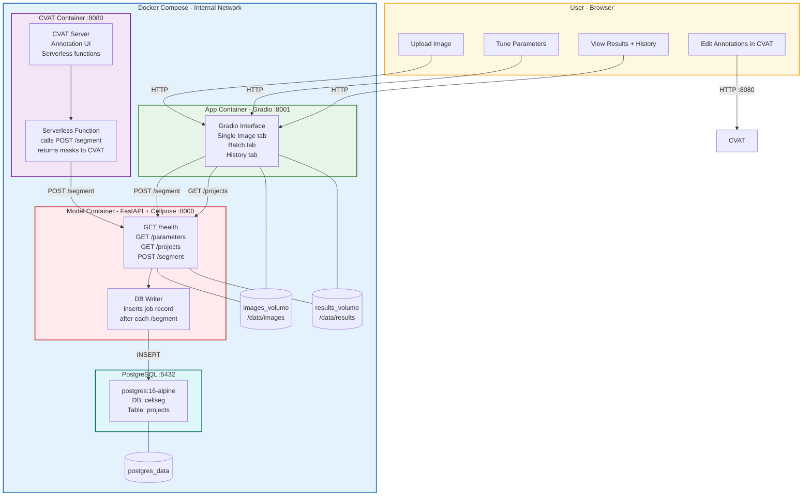
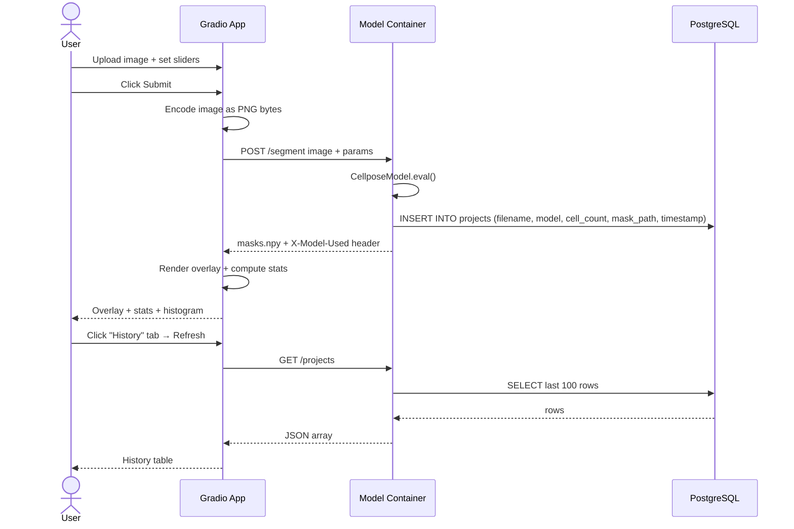
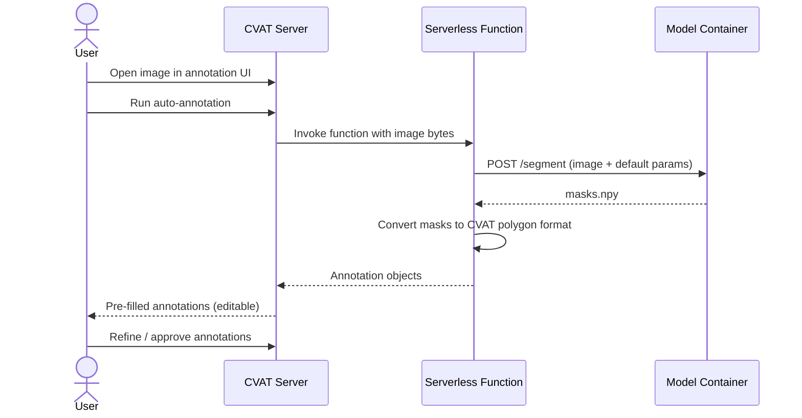

# System Architecture — Cell Segmentation Platform (v2 — Phase 3: Persistence & Annotation)

> **This is v2 of the design document.** The original `improved_system_design.md` (Phase 1 & 2) is unchanged.
> v2 adds PostgreSQL persistence, CVAT annotation integration, and shared volume mounts.

## Overview

A browser-based cell segmentation platform built on **four Docker containers**. Users upload microscopy images, tune Cellpose parameters, receive colored segmentation overlays with statistics, review segmentation history, and optionally refine annotations in CVAT. All data stays on-premise.

**Stack:** Gradio (App Container) + FastAPI/Cellpose (Model Container) + PostgreSQL (DB) + CVAT (Annotation)

---

## Architecture Diagram



---

## Data Flow — Segmentation Request (with persistence)



---

## Data Flow — CVAT Annotation



---

## Component Details

### App Container — Gradio (extended)

Three tabs:

| Tab | New in v2 | Description |
|-----|-----------|-------------|
| Single Image | No — Phase 1 | Upload + segment + download |
| Batch | No — Phase 2 | Multi-file + ZIP download |
| History | **Yes — Phase 3** | Table of past jobs from `GET /projects` |

**History tab additions:**
- `MODEL_PROJECTS_URL` env/computed from `MODEL_URL`
- `load_history()` function calling `GET /projects`
- `gr.Dataframe` with columns: ID, filename, model, cell count, timestamp
- Refresh button wired to `load_history()`

---

### Model Container — FastAPI + Cellpose (extended)

**New in v2:**

| Addition | Detail |
|----------|--------|
| `GET /projects` | Returns last 100 segmentation records from PostgreSQL |
| DB write on `/segment` | After successful inference, inserts a row into `projects` |
| `DATABASE_URL` env var | `postgresql://cellseg:cellseg@db:5432/cellseg` — gracefully skipped if unset |
| `projects` table | Created on startup if not exists |

**`projects` table schema:**

```sql
CREATE TABLE IF NOT EXISTS projects (
    id            SERIAL PRIMARY KEY,
    project_name  TEXT,
    image_filename TEXT,
    timestamp     TIMESTAMPTZ DEFAULT NOW(),
    model_used    TEXT,
    cell_count    INT,
    mask_path     TEXT
);
```

**New dependency:** `psycopg2-binary` added to `Model_container/requirements.txt`

---

### CVAT Container

**Image:** `cvat/server:latest`
**Port:** 8080 (host-mapped for browser access)
**Depends on:** `db` (PostgreSQL)

**Serverless function** (`Model_container/cvat_serverless/function.py`):
- Receives image bytes from CVAT
- POSTs to `http://model:8000/segment` with default parameters
- Converts returned `masks.npy` to CVAT polygon annotation format
- Returns annotation objects to CVAT

**Descriptor:** `Model_container/cvat_serverless/nuclio.yaml`

---

### PostgreSQL Container

**Image:** `postgres:16-alpine`
**Port:** 5432 — internal network only, never host-mapped
**Healthcheck:** `pg_isready -U cellseg`
**Volume:** `postgres_data:/var/lib/postgresql/data`

| Env var | Value |
|---------|-------|
| `POSTGRES_DB` | `cellseg` |
| `POSTGRES_USER` | `cellseg` |
| `POSTGRES_PASSWORD` | `cellseg` |

---

## Docker Compose (v2)

```yaml
services:
  app:
    build: ./App_container
    ports:
      - "8001:8001"
    environment:
      - GRADIO_SERVER_NAME=0.0.0.0
      - MODEL_URL=http://model:8000/segment
    volumes:
      - images_volume:/data/images
      - results_volume:/data/results
    depends_on:
      model:
        condition: service_healthy

  model:
    build:
      context: ./Model_container
      args:
        USE_CUDA: "true"
    expose:
      - "8000"
    environment:
      - PYTHONUNBUFFERED=1
      - USE_GPU=true
      - DATABASE_URL=postgresql://cellseg:cellseg@db:5432/cellseg
    volumes:
      - images_volume:/data/images
      - results_volume:/data/results
    depends_on:
      db:
        condition: service_healthy
    healthcheck:
      test: ["CMD", "curl", "-f", "--max-time", "5", "http://localhost:8000/health"]
      interval: 10s
      timeout: 10s
      retries: 15
      start_period: 90s
    deploy:
      resources:
        reservations:
          devices:
            - driver: nvidia
              count: 1
              capabilities: [gpu]
        limits:
          memory: 8G

  db:
    image: postgres:16-alpine
    expose:
      - "5432"
    environment:
      - POSTGRES_DB=cellseg
      - POSTGRES_USER=cellseg
      - POSTGRES_PASSWORD=cellseg
    volumes:
      - postgres_data:/var/lib/postgresql/data
    healthcheck:
      test: ["CMD", "pg_isready", "-U", "cellseg"]
      interval: 10s
      timeout: 5s
      retries: 5
      start_period: 20s

  cvat:
    image: cvat/server:latest
    ports:
      - "8080:8080"
    environment:
      - DJANGO_ALLOWED_HOSTS=localhost
    depends_on:
      db:
        condition: service_healthy
    volumes:
      - images_volume:/data/images

volumes:
  postgres_data:
  images_volume:
  results_volume:
```

---

## New Files in v2

| File | Purpose |
|------|---------|
| `Model_container/cvat_serverless/function.py` | CVAT serverless function calling `/segment` |
| `Model_container/cvat_serverless/nuclio.yaml` | Nuclio function descriptor for CVAT |

---

## Key Design Decisions (v2)

| Decision | Choice | Rationale |
|----------|--------|-----------|
| DB location | Model Container writes, not App Container | Model already has all job metadata after inference |
| DB optional | `DATABASE_URL` gracefully skipped if unset | Container still works without DB for local/test use |
| CVAT serverless | Calls existing `/segment` endpoint | Zero duplication — same Cellpose inference, same API contract |
| Volumes shared | `app` + `model` both mount `images_volume` | CVAT can serve images that were uploaded via Gradio |
| PostgreSQL | `postgres:16-alpine` | Minimal image, production-grade, no ORM overhead |
| CVAT port | Host-mapped 8080 | Users need browser access to the annotation UI directly |

---

## Security Considerations (additions to v1)

- PostgreSQL is **not host-mapped** — internal network only
- `DATABASE_URL` uses a dedicated low-privilege user (`cellseg`)
- CVAT serverless function never calls external services — only `http://model:8000`
- No user-supplied filenames used in DB inserts — sanitized before storage
- `postgres_data` volume is not shared with other containers

---

## What Changed vs. v1

| v1 | v2 |
|----|-----|
| 2 containers | 4 containers (+ PostgreSQL, + CVAT) |
| Stateless — no history | `projects` table tracks every segmentation |
| No annotation editing | CVAT available at `:8080` for annotation refinement |
| No shared volumes | `images_volume` + `results_volume` shared across containers |
| App Container has 2 tabs | App Container has 3 tabs (+ History) |
| Model Container: `/health`, `/parameters`, `/segment` | + `GET /projects` |

---

## Upgrade Path to Phase 4

1. **Auth** — Add Nginx reverse proxy in front of Gradio and CVAT. Add API key auth to Model Container.
2. **Multi-user** — Project-level permissions in PostgreSQL. CVAT already supports user accounts.
3. **Scaling** — Model Container replicas behind a load balancer. Async task queue (Celery + Redis) for long-running `cpsam` jobs.
4. **3D segmentation** — Z-stack TIFF support in the Model Container; Gradio slice viewer.
